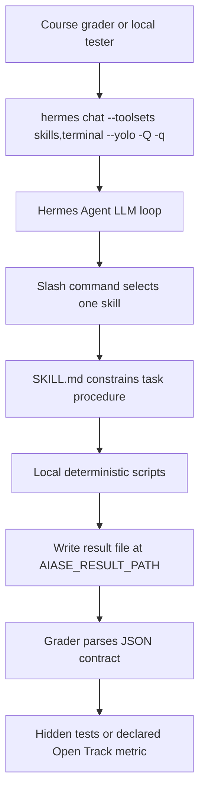
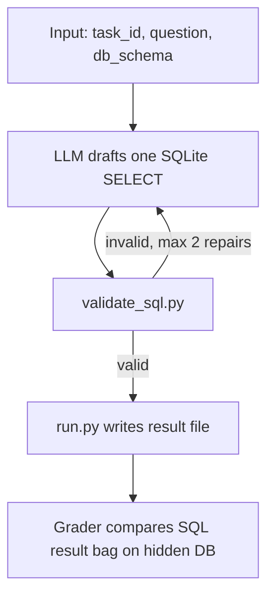
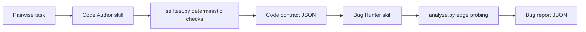
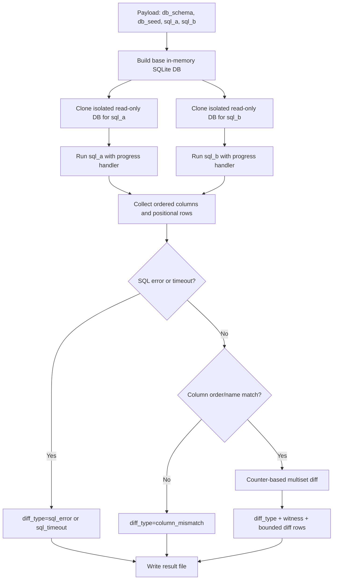

# AIASE 2026 Final Project - YunzhenYang-collection

This repository contains the AIASE 2026 final project implementation for Hermes Agent skills.

The project follows the course principle:

> deterministic shell wrapping probabilistic core

Hermes Agent provides the probabilistic LLM loop. Each submitted skill wraps that loop with `SKILL.md` constraints and local `scripts/` helpers so the final result can be automatically verified by the course grader.

All submitted skills use the file-based contract introduced by the course update:
the final JSON object is written by `scripts/run.py` to `AIASE_RESULT_PATH`.
Conversation-level fenced JSON blocks are not used as the grading output.

> Since the local system is Windows, the command in the README will use syntax compatible with the local test, but the submitted files will be based on the scoring environment (Linux).

## Submission Summary

| Track | Deliverable | Status | Main evidence |
|---|---|---|---|
| Basic | `skills/text2sql-YunzhenYang-collection/` | Completed Text2SQL skill with file-based result output and SQL validation | `validate_sql.py` tests, contract tests, single-task Hermes verification |
| Pairwise | `skills/code-author-YunzhenYang-collection/` and `skills/bug-hunter-YunzhenYang-collection/` | Both roles implemented and declared in `PAIRWISE_ROLE.md` | Code Author / Bug Hunter file-based checks, clean and buggy cases, `verify_repo.py` |
| Open Track | `skills/open-sql-result-diff-YunzhenYang-collection/` | Completed deterministic SQL result diff analyzer | `tests/test_open_track.py`, Hermes demo, side-effect isolation, timeout protection |

The full design rationale, failure analysis, screenshots, and final checklist are in [`report.md`](report.md).

## Required Project Files

| File | Purpose |
|---|---|
| [`report.md`](report.md) | Final report with design decisions, failure analysis, screenshots, improvement notes, and submission checklist |
| [`PAIRWISE_ROLE.md`](PAIRWISE_ROLE.md) | Declares the Pairwise Code Author and Bug Hunter skill paths |
| [`OPEN_TRACK.md`](OPEN_TRACK.md) | Declares Open Track input schema, metric, pass/fail rule, and call format |
| [`verify_repo.py`](verify_repo.py) | Local repository sanity checker |
| [`run_dev.py`](run_dev.py) | Local dev-set runner using the course-style Hermes invocation |
| [`requirements.txt`](requirements.txt) | Python dependencies used by local tests |
| [`TAICA2026_FinalProject.md`](TAICA2026_FinalProject.md) | Course final project specification |

## Project Structure

```text
.
├── skills/
│   ├── text2sql-YunzhenYang-collection/
│   │   ├── SKILL.md
│   │   └── scripts/
│   │       ├── run.py
│   │       ├── validate_sql.py
│   │       └── requirements.txt
│   ├── code-author-YunzhenYang-collection/
│   │   ├── SKILL.md
│   │   └── scripts/
│   │       ├── run.py
│   │       ├── selftest.py
│   │       └── requirements.txt
│   ├── bug-hunter-YunzhenYang-collection/
│   │   ├── SKILL.md
│   │   └── scripts/
│   │       ├── run.py
│   │       ├── analyze.py
│   │       └── requirements.txt
│   └── open-sql-result-diff-YunzhenYang-collection/
│       ├── SKILL.md
│       └── scripts/
│           └── run.py
├── tests/
│   ├── test_validate_sql.py
│   ├── test_open_track.py
│   ├── test_machine_checkable_contracts.py
│   └── ...
├── dev_set/
│   ├── basic/
│   └── pairwise/
├── docs/
│   ├── hermes-config.example.yaml
│   └── hermes-env.example
├── log/
│   └── screenshot evidence used by report.md
├── OPEN_TRACK.md
├── PAIRWISE_ROLE.md
├── report.md
├── run_dev.py
└── verify_repo.py
```

Reference skills and starter update files are kept for comparison, but the submitted skills are the four `*-YunzhenYang-collection` folders listed above.

## Overall Execution Flow



The key design choice is that the LLM may draft or interpret, but final contract writing and validation are handled by deterministic scripts.

## Track Guide

### Basic - Text2SQL

Skill path:

```text
skills/text2sql-YunzhenYang-collection/
```

Purpose:

- Convert a natural-language question and SQLite schema into one read-only SQLite `SELECT`.
- Validate SQL with a deterministic helper before writing the result.
- Write a file-based result through `AIASE_RESULT_PATH`.

Flow:



Important implementation notes:

- `validate_sql.py` rejects non-read-only SQL and uses SQLite `EXPLAIN` for syntax and name resolution.
- `validate_sql.py` accepts both `schema_ddl` and `db_schema` to avoid payload-key mismatch.
- `SKILL.md` uses repo-relative script paths to avoid extra filesystem search during Hermes execution.

### Pairwise - Code Author and Bug Hunter

Skill paths:

```text
skills/code-author-YunzhenYang-collection/
skills/bug-hunter-YunzhenYang-collection/
```

Declared in:

```text
PAIRWISE_ROLE.md
```

Code Author:

- Generates Python code for the requested entry function.
- Runs `selftest.py` once with three representative samples.
- Checks compile/exec, entry function presence, sample tests, forbidden imports, and SLOC.
- Writes the Code Author JSON contract through `scripts/run.py` to `AIASE_RESULT_PATH`.

Bug Hunter:

- Reads candidate code and task description.
- Uses `analyze.py` for AST parsing and deterministic edge probing.
- Reports conservative line-level bugs.
- Guarantees `verdict=clean` implies `bugs=[]`.
- Writes the Bug Hunter JSON contract through `scripts/run.py` to `AIASE_RESULT_PATH`.

Pairwise flow:



### Open Track - SQL Result Diff Analyzer

Skill path:

```text
skills/open-sql-result-diff-YunzhenYang-collection/
```

Declared in:

```text
OPEN_TRACK.md
```

Purpose:

- Compare two SQL queries, `sql_a` and `sql_b`, against the same SQLite schema and seed data.
- Decide whether their result multisets are equivalent.
- Emit a machine-readable diff with `diff_type`, `witness`, and bounded row differences.

Open Track metric:

```text
equivalent(sql_a, sql_b) = their result multisets are equal on the same seed database
```

Open Track flow:



Open Track robustness features:

- Uses Python standard-library `sqlite3`; no external database or network service is required.
- Executes `sql_a` and `sql_b` on isolated read-only DB copies, so side effects do not pollute the other query.
- Compares rows as multisets, so duplicate rows are counted.
- Preserves duplicate column names using positional canonicalization.
- Normalizes SQLite values for stable JSON output.
- Bounds displayed diff rows while preserving total diff counts.
- Uses SQLite progress handlers to return `sql_a_timeout:` or `sql_b_timeout:` rather than hanging.
- Writes the Open Track JSON contract through `scripts/run.py` to `AIASE_RESULT_PATH`.

## Setup

Install Python dependencies:

```powershell
python -m pip install -r requirements.txt
```

Build Basic Track SQLite dev databases:

```powershell
python dev_set/basic/build_dbs.py
```

Configure Hermes to use the course LiteLLM Gateway and this repo's `skills/` directory. Example files are provided in:

```text
docs/hermes-config.example.yaml
docs/hermes-env.example
```

Do not commit real API tokens. `.hermes/`, local env files, generated DBs, and dev-run outputs are ignored by git.

## Local Verification

Run repository checks:

```powershell
python verify_repo.py --github-id YunzhenYang-collection
```

Run unit and contract tests:

```powershell
python -m pytest -p no:cacheprovider
```

Focused checks:

```powershell
python -m pytest tests/test_validate_sql.py -p no:cacheprovider
python -m pytest tests/test_open_track.py -p no:cacheprovider
python -m pytest tests/test_machine_checkable_contracts.py -p no:cacheprovider
```

Report evidence includes these checkpoints:

```text
verify_repo.py: 27/27 passed
pytest after error normalization: 193 passed
machine-checkable contract tests: 3 passed
```

Screenshots are stored in [`log/`](log/) and embedded in [`report.md`](report.md).

## Hermes Smoke Tests

Confirm Hermes sees the project skills:

```powershell
hermes config path
hermes doctor
hermes skills list
```

Expected submitted skills:

```text
text2sql-YunzhenYang-collection
code-author-YunzhenYang-collection
bug-hunter-YunzhenYang-collection
open-sql-result-diff-YunzhenYang-collection
```

Basic single-task invocation shape:

```powershell
hermes chat --toolsets skills,terminal --yolo -Q -q '/text2sql-YunzhenYang-collection {"task_id":"...","question":"...","db_schema":"..."}'
```

Open Track deterministic helper smoke test:

```powershell
python skills/open-sql-result-diff-YunzhenYang-collection/scripts/run.py '{"task_id":"diff_001","db_schema":"CREATE TABLE orders (id INT, amount FLOAT, status TEXT);","db_seed":"INSERT INTO orders VALUES (1, 50.0, ''paid''), (2, 30.0, ''pending''), (3, 80.0, ''paid'');","sql_a":"SELECT id FROM orders WHERE status = ''paid''","sql_b":"SELECT id FROM orders WHERE amount > 60 AND status = ''paid''"}'
Get-Content aiase_result.json
```

## Timeout Notes

Some early batch runs through `run_dev.py` hit wall-clock timeouts. The final version reduces controllable timeout risk by:

- shortening Text2SQL to `draft -> validate -> write result file`;
- capping SQL validation repair attempts;
- using repo-relative script paths;
- reducing Code Author to three sample tests and exactly one `selftest.py` call;
- bounding Open Track SQL execution and diff output.

The report distinguishes between controllable workflow overhead and external shared-server latency from the course LiteLLM Gateway. Single-task Hermes invocation is the recommended way to verify individual timeout cases.

## Submission Checklist

- Basic skill exists and writes file-based results.
- Pairwise Code Author and Bug Hunter skills exist and are declared in `PAIRWISE_ROLE.md`.
- Open Track skill exists and is declared in `OPEN_TRACK.md`.
- All submitted `SKILL.md` names match their folder names.
- Skill commands use repo-relative script paths.
- `scripts/run.py` files support `AIASE_RESULT_PATH`.
- Output JSON preserves input `task_id`.
- No submitted skill requires external network services, personal secrets, or local absolute paths.
- `report.md` includes design rationale, failure analysis, screenshots, and final checklist.
- No video demo is required unless the course staff separately announces one.
