# 期末報告 — AIASE 2026 Final Project

> 學生:楊芸蓁 / GitHub: `YunzhenYang-collection`

---

## 0. 目錄

本 repo 已依期末專案規格完成 Basic、Pairwise、Open Track 三部分，並將三個 Track 的 skill、宣告檔、測試紀錄與失敗分析整理在本報告中。專案流程的設計理念依照作業指引所寫明：LLM 負責語意判斷，`scripts/` 負責 deterministic validation、contract normalization 與 result-file output。

| Track | 上交檔案/內容 | 目前狀態 | 主要驗證證據 |
|---|---|---|---|
| Basic | `skills/text2sql-YunzhenYang-collection` | 已完成 Text2SQL skill；支援 file-based result；SQL 先經 read-only / `EXPLAIN` validation | `validate_sql.py` 測試、machine-checkable contract tests、單題 Hermes invocation |
| Pairwise | `skills/code-author-YunzhenYang-collection` 與 `skills/bug-hunter-YunzhenYang-collection` | 兩個 roles 皆已實作並於 `PAIRWISE_ROLE.md` 宣告；Code Author 產生 code contract，Bug Hunter 做 conservative bug report | Code Author / Bug Hunter file-based 驗證、`verify_repo.py`、clean false-positive 與 buggy case 測試 |
| Open Track | `skills/open-sql-result-diff-YunzhenYang-collection` | 已完成 SQL result diff analyzer；能比較兩段 SQL 的 multiset result，並輸出 machine-readable `diff_type` 與 `witness` | `tests/test_open_track.py`、Hermes demo、side-effect isolation、timeout protection |

> **截圖說明：由於本機端為 Windows 系統，所以截圖當中的指令會使用與本機測試相容之語法，但是上交文件會以評分環境 (Linux) 為主。**

### 已知限制與處理方式

- Basic Text2SQL 的 `validate_sql.py` 主要保證 SQL 語法、欄位與 read-only contract，無法在 hidden DB 之前保證語意完全正確；這是 Text2SQL 題型本身之限制，因此在這份報告中會將其列為後續改進方向。
- 早期批次測試曾遇到 Hermes / LLM 端到端 timeout。後續已縮短 `SKILL.md` workflow、限制 retry、固定 repo-relative script path，並把 deterministic helper 維持在短流程；剩餘連續批次延遲主要來自 shared LiteLLM Gateway / server endpoint，而不是 helper script 自身卡住。
- Open Track 的 verifier 需要輸入提供 `db_schema`、`db_seed`、`sql_a`、`sql_b`；這些需求已在 `OPEN_TRACK.md` 中宣告，且不依賴外部網路、個人 API key 或本機絕對路徑。

---

## 1. 設計決策

整體架構可以分成「Hermes 負責 agent loop」、「SKILL.md 負責約束 LLM 行為」、「scripts/ 負責 deterministic validation/output」：

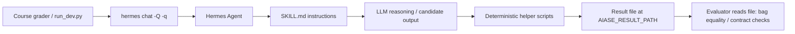

### 1.1 Basic — Text2SQL Skill

#### 核心設計理念

本 skill 的設計遵循課程核心概念：**deterministic shell wrapping probabilistic core**。LLM（probabilistic core）負責理解自然語言問題、根據 schema 草擬 SQL；`scripts/` 下的 Python helper（deterministic shell）負責做可重複的驗證與輸出格式控制。

整體流程如下：

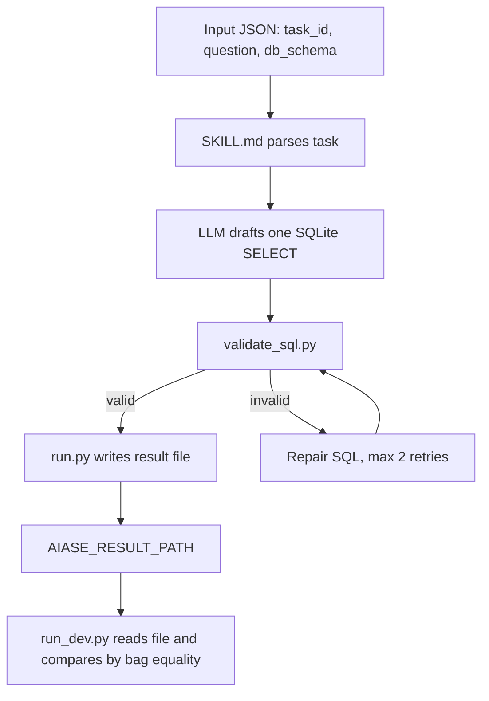

這樣切分的原因是 Text2SQL 的語意理解本身需要 LLM 協助，但「SQL 是否為 read-only」、「欄位是否存在」、「輸出是否符合 contract」不應交給 LLM 自由判斷，而應由 deterministic harness 強制保證。

#### SKILL.md 設計決策

第一版 starter 的 `SKILL.md` 包含明確的 `Plan` 步驟，要求 LLM 先識別 table、JOIN key、filter、aggregation，再撰寫 SQL。這在可讀性上有幫助，但實測會造成兩個問題：

- 每題推理時間偏長，端對端測試曾出現約 4-5 分鐘的執行時間。
- LLM 容易在執行 script 前輸出大量分析文字；在舊版 stdout 擷取流程中，這會增加 fenced JSON 擷取的不確定性。

因此改版後把內容改成更短的快速流程，要求 LLM 直接 draft SQL、立即 validate、立即呼叫 `run.py` 寫結果檔：

```markdown
## Procedure

1. Parse `task_id`, `question`, `db_schema`, `dialect`.
2. Draft exactly one SQLite `SELECT` query. Keep it read-only and single-statement.
3. Validate immediately. Do not search files.
4. Write the result file immediately by running `scripts/run.py`.
```

另一個關鍵決策是在 `SKILL.md` 中直接寫出 repo-relative 完整路徑：

```bash
python skills/text2sql-YunzhenYang-collection/scripts/validate_sql.py '{"schema_ddl":"<db_schema>","sql":"<sql>"}'
```

前期測試發現，如果只寫 `scripts/validate_sql.py`，Hermes 的 working directory 若在 repo 根目錄而非 skill 資料夾，就會先執行錯誤路徑，再用 `ls -R` 搜尋檔案位置，造成額外時間成本。直接給完整路徑可以避免 agent 做不必要的 filesystem exploration。

#### Harness 設計：validate_sql.py

`validate_sql.py` 採用兩層驗證策略：

| 層次 | 方法 | 目的 |
|---|---|---|
| 靜態檢查 | Regex 比對禁止關鍵字，例如 `INSERT`、`UPDATE`、`DELETE`、DDL、`PRAGMA` | 快速拒絕非 read-only SQL |
| 動態驗證 | In-memory SQLite + `EXPLAIN <sql>` | 確認語法合法、table/column/alias 可解析 |

選擇 `EXPLAIN` 而非直接執行 SQL 的原因是：Basic Track 驗證階段不一定有真實資料，直接執行查詢沒有必要；`EXPLAIN` 可以讓 SQLite 完成 parse 與 name resolution，足以抓到 typo、不存在的欄位名、錯誤 alias 等常見錯誤。

驗證失敗時，script 回傳：

```json
{"ok": false, "error": "<sqlite error>"}
```

LLM 可以根據錯誤訊息修正 SQL。為了避免 timeout，`SKILL.md` 將 retry 上限設為 2 次，而不是無限制重試以減少輸出時間。

#### Harness 設計：run.py

`run.py` 只做一件事：把 LLM 傳入的 `{task_id, sql, rationale, confidence}` 格式化成規定的 JSON object，並寫入 `AIASE_RESULT_PATH` 指定的結果檔；若環境變數不存在，才 fallback 到工作目錄下的 `./aiase_result.json`。這讓最後輸出位置與格式由 deterministic script 控制，即使 LLM 在內部推理過程中格式略有偏差，評分器仍只讀取穩定的 result file。

#### SQL Rules 設計

`SKILL.md` 中明確列出 SQL 限制，目的是減少 retry 次數，並把常見錯誤前移到 prompt 層預防：

- SQLite only。
- 只允許單一 `SELECT` statement。
- 禁止 `WITH`、recursive queries、window functions。
- table 與 column 必須來自輸入的 `db_schema`。
- 當問題語意是「哪些 entity」且 join 可能產生重複列時，使用 `DISTINCT`。
- 輸出的 `task_id` 必須完全等於輸入。

### 1.2 Pairwise — Code Author + Bug Hunter

Pairwise Track 同時提交 `code-author-YunzhenYang-collection` 與 `bug-hunter-YunzhenYang-collection`，並在 `PAIRWISE_ROLE.md` 中宣告兩個角色。設計上兩者都採用「LLM 做語意判斷、scripts 做 deterministic 檢查」的結構。

| Role | LLM 負責 | Script 負責 | 主要風險 | 對應設計 |
|---|---|---|---|---|
| Code Author | 依 `task_description` 撰寫 Python function，挑選代表性 sample cases | `selftest.py` compile / exec、sample tests、SLOC、forbidden imports；`run.py` 寫 file-based contract | timeout、sample input 包裝錯誤、漏掉 boundary case | 3 samples、exactly one selftest、一次 `run.py` 寫檔 |
| Bug Hunter | 判斷 analyzer signal 是否真的是 bug，產生 line-level report | `analyze.py` AST parsing、edge probing、suspicious line range | false positive、line number 不準、把 clean code 誤判為 buggy | conservative reporting、最小 line range、`verdict=clean` 時 `bugs=[]` |

#### Code Author 設計

Code Author 的目標是根據 `task_description` 和 `constraints.entry_function` 產生一個完整 Python function，並輸出 Pairwise Code Author contract。早期版本要求 LLM 產生 5 個 sample tests、執行 `selftest.py`，再透過 `run.py` 包裝輸出。實測發現這個流程會增加 Hermes tool call 與 LLM 往返時間，因此後續改成：

- 保留教授要求的 `When to Use` / `Procedure` / `Pitfalls` / `Verification` 格式。
- 保留 `scripts/selftest.py` 作為 deterministic harness。
- 將 sample tests 從 5 個降為 3 個：empty/minimal、normal、tricky boundary。
- 明確規定 `sample_inputs.input` 是 positional arguments list，避免單參數 list 被錯誤拆參數。
- 每題只執行一次 `selftest.py`，不進行 repair loop。
- 最後只呼叫一次 `scripts/run.py` 寫出 Code Author JSON contract，避免依賴對話輸出格式。

`selftest.py` 會檢查：

- candidate code 是否能 compile / exec。
- 是否定義 `constraints.entry_function`。
- 是否通過 LLM 產生的 sample cases。
- 是否違反 `imports_forbidden`。
- 是否超過 `max_loc`。

#### Bug Hunter 設計

Bug Hunter 的目標是讀入另一個 Code Author 產生的 Python code，根據 `task_description` 找出實際 bug，並輸出 `verdict` 與 `bugs[]`。它搭配 `scripts/analyze.py` 做 deterministic probing：先解析 AST 找 entry function，再用固定 edge inputs 測試 crash / mismatch / suspicious line range。LLM 只負責把 analyzer signal 轉成較精準的 bug report，避免完全憑直覺亂報。

`scripts/analyze.py` 會在受控 probing 階段使用 `exec(compile(...))` 載入 candidate code，這是 Pairwise Bug Hunter 為了驗證「實際執行是否 crash、timeout 或與 expected output mismatch」所需的動態檢查。此步驟不會呼叫 shell、不讀取工作目錄以外的檔案、不連外網，並以固定 edge inputs 與 timeout guard 限制執行範圍；最終輸出仍由 `scripts/run.py` 正規化成 `verdict` / `bugs[]` contract。

我保留「AST/static analysis + dynamic probing」的混合式設計，而不是改成純 AST/static analysis。原因是純靜態分析雖可降低對 `exec` 的敏感度，但會明顯削弱對 empty-input crash、boundary mismatch、off-by-one、invalid `k` 等實際 hidden-test failure 的偵測能力。目前 AST 負責定位 entry function、return/loop line 與 suspicious line，dynamic probing 負責提供可重現的錯誤證據；這比只靠 LLM 或只靠 AST 更符合 Pairwise Track 的 F1 / false-positive 評分目標。

#### Pairwise 目前進度

file-based 更新後，Code Author 與 Bug Hunter 皆已完成端對端驗證。此階段測試重點不是只確認 `scripts/run.py` 能單獨執行，而是確認 Hermes 透過 `-Q` 呼叫 skill 後，結果能正確寫入 `AIASE_RESULT_PATH` 指定的結果檔。

- Code Author `task_pair_001`：結果檔正確寫出，`task_id` 正確，`code` 非空，`self_test_results.passed=3, failed=0`
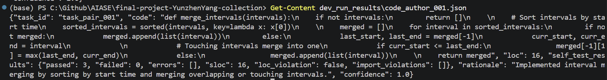
- Bug Hunter `task_pair_001` buggy：`verdict=buggy`，`line_start=3`，`type=edge_case`，正確抓到 empty input 未 guard 就讀取 `intervals[0]` 的問題
- Bug Hunter `task_pair_001` clean：`verdict=clean`，`bugs=[]`，clean false-positive 測試通過
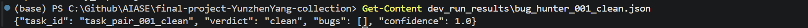
- Bug Hunter `task_pair_005` buggy：兩個 bug 皆抓到，分別為 `off_by_one` 與 `unhandled_input`
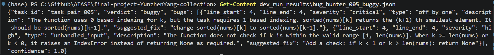
- `verify_repo.py`：27/27 全過
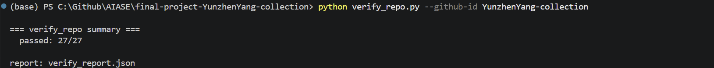

後續已將 Code Author `SKILL.md` 縮短為 3 samples + exactly one selftest，並已透過 file-based 端對端驗證確認正常運作。Bug Hunter 則以 clean FP 與多題 buggy cases 驗證其 conservative reporting 策略，避免只在單一 reference task 上過度擬合。

截圖說明（前期測試）：

- 批次呼叫 code-author 時 120 秒 timeout。
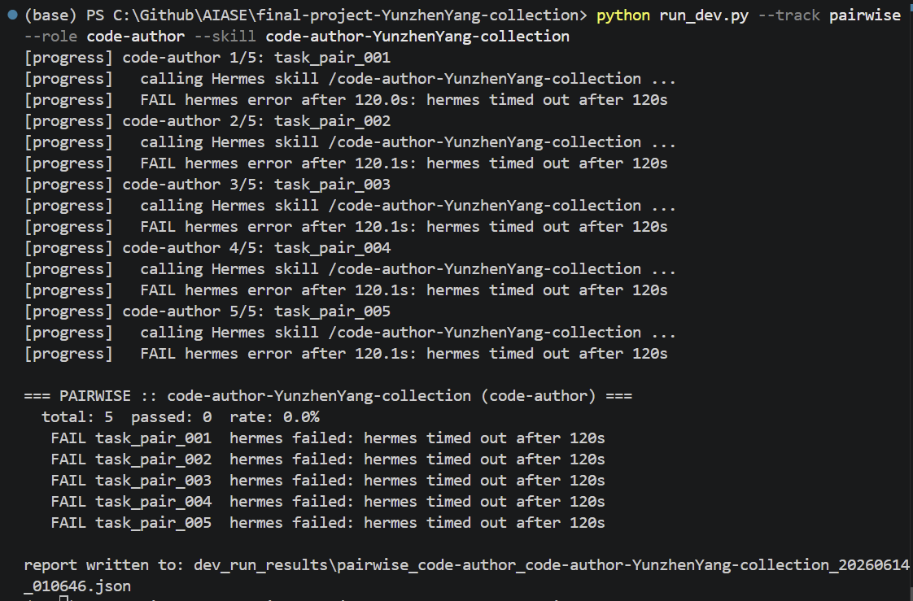：`run_dev.py`
- 單題 direct Hermes invocation 已能進入 `selftest.py`：
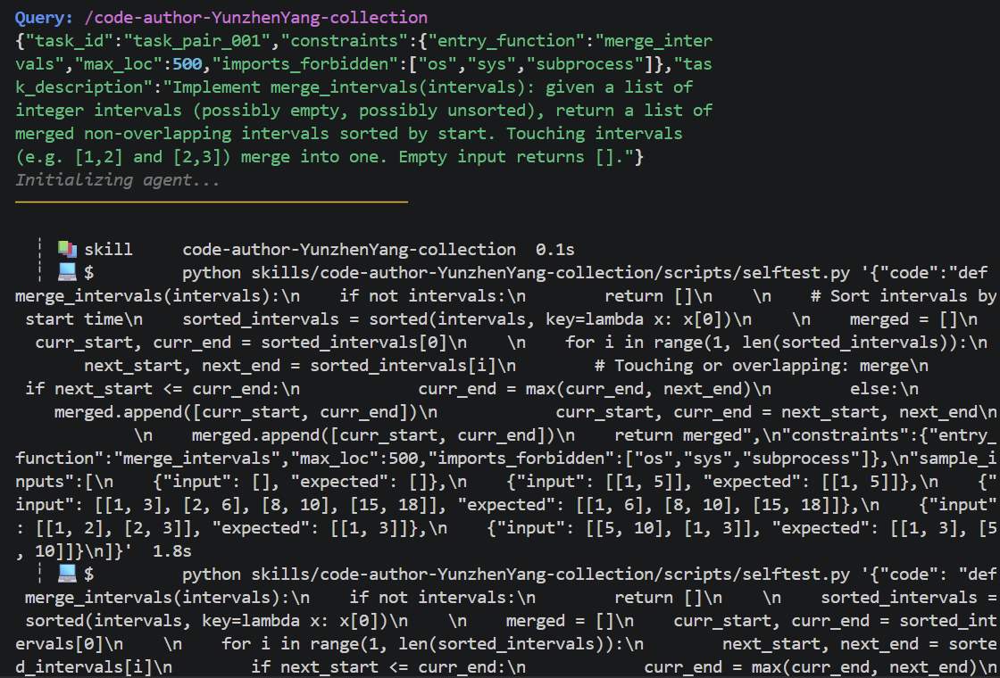
- 單題成功輸出 contract，但 session duration 仍超過 120 秒：
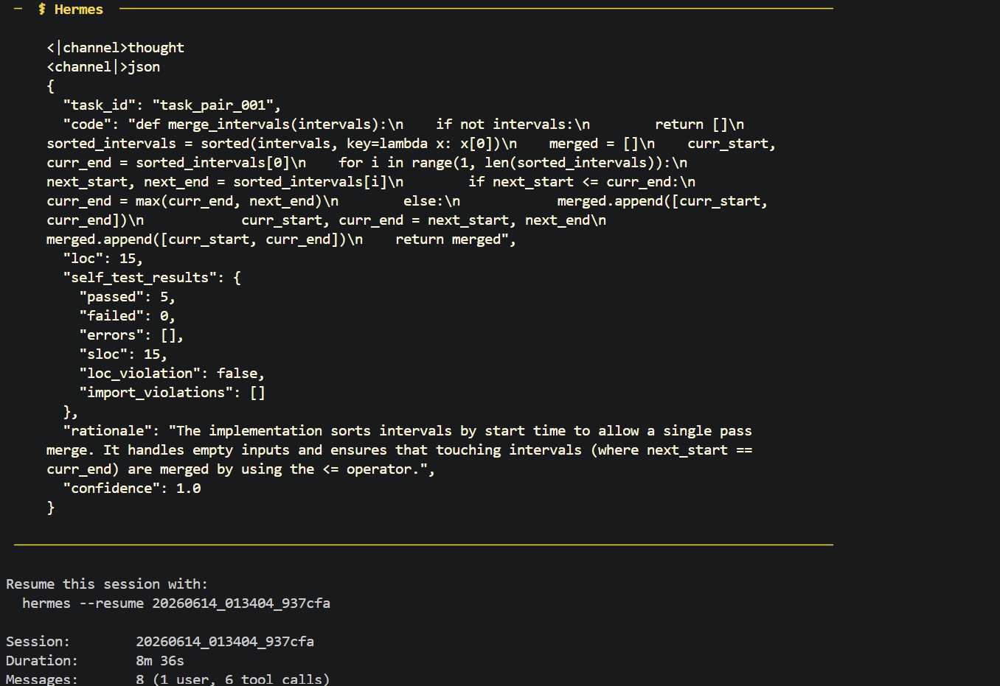

### 1.3 Open Track — SQL Result Diff Analyzer

Open Track skill 採用 `open-sql-result-diff-YunzhenYang-collection`。設計目標是把 Basic Track Text2SQL 的 candidate SQL 接到一個 deterministic verifier：給定同一份 SQLite schema 與 seed data，實際執行 `sql_a` 與 reference `sql_b`，再比較兩邊的 result set 是否等價。

#### 評分視角摘要

Open Track 佔本專案最高比例，因此這個 skill 的設計目標不是做一個只能展示的 demo，而是做一個可以被自動驗證的 SQL semantic checker。它的輸入、輸出與 metric 都能被 grader 程式化檢查：

- **任務輸入**：`task_id`、`db_schema`、`db_seed`、`sql_a`、`sql_b`。
- **核心 metric**：兩段 SQL 在同一份 seed database 上的 result multiset 是否等價。
- **pass/fail 判定**：`equivalent=true/false`、`diff_type`、`witness`、`rows_only_in_a_total`、`rows_only_in_b_total`。
- **可驗證性**：比較邏輯全部在 `scripts/run.py`，不依賴 LLM 自由判斷；LLM 只需觸發 skill 並交付輸入。
- **perturbation robustness**：資料順序改變時使用 multiset diff，不受 row order 影響；side-effect SQL 透過 isolated DB copies 隔離；昂貴 query 由 SQLite progress handler 截止。

因此，Open Track 的差異化重點在於「把 Text2SQL 的語意正確性轉成可執行、可比對、可保存反例的 deterministic harness」。若兩段 SQL 不等價，輸出不只說明失敗，還會提供最小 witness row，讓錯誤原因可以被機器與人類同時檢查。

核心設計想法：

- 使用 Python 標準庫 `sqlite3` 建立 in-memory database，避免外部 DB 或網路依賴。
- schema 與 seed 只建立一次 base DB，再 clone 成 `sql_a` / `sql_b` 兩份 isolated read-only DB copies，避免其中一段 SQL 的 side effect 污染另一段。
- 先比對 column names 與 column order；若不同，直接判定 `equivalent=false`。
- rows 使用 `Counter` 做 multiset diff，因此 duplicate rows 也會被正確計入。
- row key 使用欄位位置與欄位名稱共同 canonicalize，避免 `SELECT id, id` 這類 duplicate column name 被 Python dict 覆蓋。
- SQLite value canonicalization 採用 SQLite-friendly policy：`1.0` 這類整數型 float 視為 `1`，BLOB 以 hex object 表示，`NULL` 保持 JSON `null`。
- diff rows 最多各顯示 100 筆，完整差異數另以 `rows_only_in_a_total` / `rows_only_in_b_total` 保留，避免大型 seed 造成結果檔過大。
- 使用 SQLite progress handler 限制昂貴查詢，recursive CTE 或巨大 join 超限時回傳 `sql_a_timeout:` / `sql_b_timeout:`，不讓評分流程卡死。
- 輸出 `diff_type` 與 `witness`，讓結果除了可讀的 `rationale` 之外，也有 machine-readable failure category 與最小反例。
- `rationale` 由 script 以 template 產生，不交給 LLM 自由生成，避免 non-determinism。
- SQL execution error 會回傳合法 JSON，`error` 以 `schema_error:`、`seed_error:`、`sql_a_error:`、`sql_b_error:`、`sql_a_timeout:` 或 `sql_b_timeout:` 開頭，`confidence=0.0`。若只有一邊 SQL 失敗，另一邊已成功取得的 columns 與 row count 仍會保留。

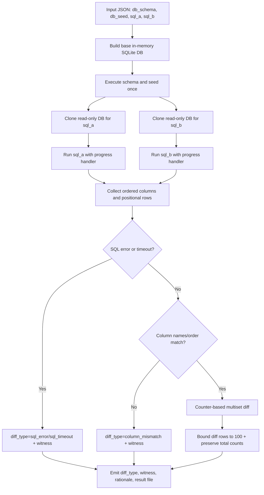

#### Open Track Interaction Log

##### Unit Test 驗證（scripts/run.py 直接執行）

執行指令：

```powershell
python -m pytest tests/test_open_track.py -p no:cacheprovider
```

| Scenario | task_id | 預期 | 結果 |
|---|---|---|---|
| SQL A error preserves SQL B | `diff_err` | `sql_a_error`, `columns_b=["id"]`, `row_count_b=1` | PASS |
| SQL B error preserves SQL A | `diff_b_err` | `sql_b_error`, `columns_a=["id"]`, `row_count_a=1` | PASS |
| Missing input guard | `diff_missing` | `diff_type=input_error`, 不執行 SQL | PASS |
| Numeric normalization | `diff_numeric` | `1.0` 與 `1` 判定等價 | PASS |
| Multiset duplicate | `diff_multiset` | `rows_only_in_a=[{"id":1}]`, total count 正確 | PASS |
| Large diff truncation | `diff_large` | 只顯示前 100 筆，total count=150 | PASS |
| Side-effect isolation | `diff_side_effect` | `DELETE` 被 read-only copy 阻擋，`sql_b` 仍回 2 rows | PASS |
| BLOB canonicalization | `diff_blob` | BLOB 以 `{"__blob_hex__": ...}` 表示 | PASS |
| Duplicate columns | `diff_duplicate_columns` | `id#1`, `id#2` 保留 positional diff | PASS |
| Query timeout | `diff_timeout` | recursive CTE 回 `sql_a_timeout:` | PASS |
| Column mismatch witness | `diff_column_witness` | `witness` 回傳兩邊 columns | PASS |

目前完整測試集執行結果：

```text
python -m pytest -p no:cacheprovider
186 passed, 1 skipped
```

##### 端對端 Hermes 驗證

執行指令：

```powershell
hermes chat --toolsets skills,terminal --yolo -Q -q "/open-sql-result-diff-YunzhenYang-collection {`"task_id`":`"diff_001`",`"db_schema`":`"CREATE TABLE orders (id INT, amount FLOAT, status TEXT);`",`"db_seed`":`"INSERT INTO orders VALUES (1, 50.0, 'paid'), (2, 30.0, 'pending'), (3, 80.0, 'paid');`",`"sql_a`":`"SELECT id FROM orders WHERE status = 'paid'`",`"sql_b`":`"SELECT id FROM orders WHERE amount > 60 AND status = 'paid'`"}"
```

Session 資訊：

- Session ID: `20260613_223506_46139d`
- Duration: `7m 28s`
- Messages: `16`（1 user, 14 tool calls）

Hermes 執行過程：

1. 載入 `open-sql-result-diff-YunzhenYang-collection` skill。
2. 依 `SKILL.md` 先 echo 一行 `[open-sql-diff] task_id=... | sql_a=... | sql_b=...` 作互動確認。
3. 透過 terminal tool 執行 `python skills/open-sql-result-diff-YunzhenYang-collection/scripts/run.py`。
4. Script 建立 base in-memory SQLite，clone 兩份 isolated read-only DB，分別執行 `sql_a` 和 `sql_b`，做 multiset diff。
5. Hermes 讀回 `written ok -> <path>`，停止，不手寫 JSON answer。

輸出結果：

```json
{
  "columns_a": ["id"],
  "columns_b": ["id"],
  "confidence": 1.0,
  "diff_rows_truncated": false,
  "diff_type": "row_multiset_mismatch",
  "equivalent": false,
  "error": "",
  "execution_mode": "isolated_read_only",
  "rationale": "Result sets differ: 1 rows appear only in sql_a, 0 rows appear only in sql_b.",
  "row_count_a": 2,
  "row_count_b": 1,
  "rows_only_in_a": [{"id": 1}],
  "rows_only_in_b": [],
  "rows_only_in_a_total": 1,
  "rows_only_in_b_total": 0,
  "task_id": "diff_001",
  "value_normalization": {
    "blob_encoding": "hex",
    "duplicate_column_suffix": "#<position>",
    "integral_float_as_int": true
  },
  "witness": {
    "type": "row_only_in_a",
    "side": "sql_a",
    "row": {"id": 1}
  }
}
```

結論：candidate SQL（`sql_a`）與 reference SQL（`sql_b`）結果不等價，diff 正確定位出 `id=1` 這筆最小反例。Pipeline 完整執行，skill 輸出符合 output contract，且 failure category、witness、total diff counts 皆可由 grader 程式化檢查。

##### Demo 指令

一般 row diff 與 witness：

```powershell
python skills/open-sql-result-diff-YunzhenYang-collection/scripts/run.py '{"task_id":"diff_001","db_schema":"CREATE TABLE orders (id INT, amount FLOAT, status TEXT);","db_seed":"INSERT INTO orders VALUES (1, 50.0, ''paid''), (2, 30.0, ''pending''), (3, 80.0, ''paid'');","sql_a":"SELECT id FROM orders WHERE status = ''paid''","sql_b":"SELECT id FROM orders WHERE amount > 60 AND status = ''paid''"}'
Get-Content aiase_result.json
```

截圖：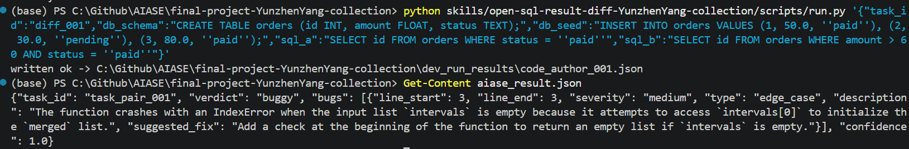

Side-effect isolation：

```powershell
python skills/open-sql-result-diff-YunzhenYang-collection/scripts/run.py '{"task_id":"diff_side_effect","db_schema":"CREATE TABLE t (id INT);","db_seed":"INSERT INTO t VALUES (1), (2);","sql_a":"DELETE FROM t","sql_b":"SELECT id FROM t"}'
Get-Content aiase_result.json
```

截圖：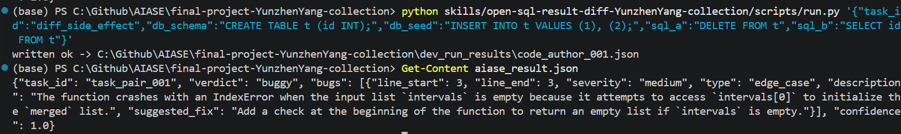

Timeout protection：

```powershell
python skills/open-sql-result-diff-YunzhenYang-collection/scripts/run.py '{"task_id":"diff_timeout","db_schema":"CREATE TABLE t (id INT);","db_seed":"","sql_a":"WITH RECURSIVE cnt(x) AS (SELECT 1 UNION ALL SELECT x + 1 FROM cnt WHERE x < 100000000) SELECT sum(x) FROM cnt","sql_b":"SELECT id FROM t"}'
Get-Content aiase_result.json
```

截圖：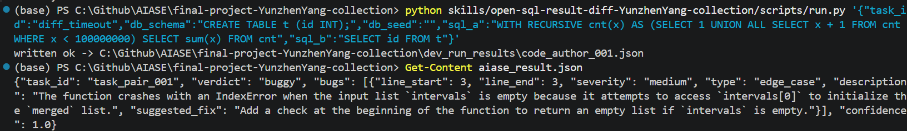

截圖說明：

- Open Track skill 的基本執行紀錄，確認 Hermes 可以載入 `open-sql-result-diff-YunzhenYang-collection`，並透過 `scripts/run.py` 寫出 file-based result
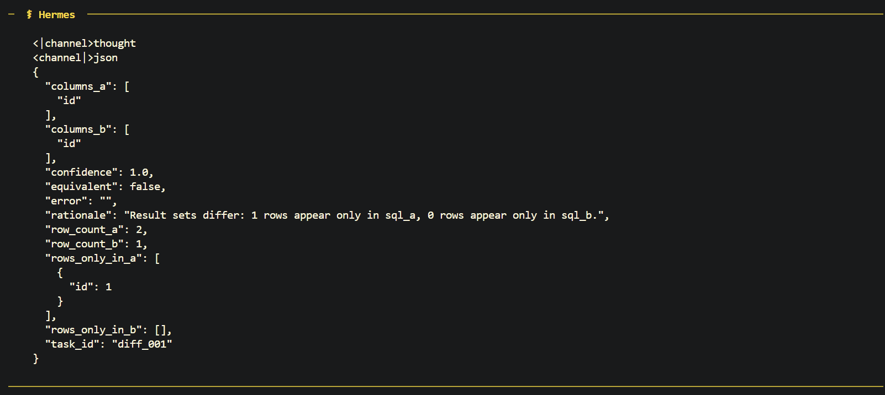

- 一般 row-level diff 案例。`sql_a` 與 `sql_b` 欄位相同但 row multiset 不同，輸出 `diff_type="row_multiset_mismatch"`，並在 `witness` 中指出只出現在 `sql_a` 的反例 row：
  

  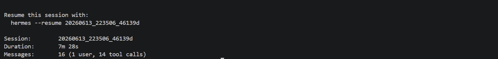

- side-effect isolation 案例。`sql_a` 嘗試執行 `DELETE`，但因為兩邊 SQL 在 isolated read-only DB copy 上執行，所以不會污染 `sql_b` 的結果：


- timeout protection 案例。recursive CTE 這類昂貴查詢會被 SQLite progress handler 中止，輸出 `sql_a_timeout:`，避免 verifier 本身卡住整個評分流程：


---

## 2. 實際遭遇之失敗與分析


| Failure | Symptom | Root cause | MAST category | Fix / Mitigation |
|---|---|---|---|---|
| Skill contract mismatch: schema key and script path | `validate_sql.py` 驗證失敗，Hermes 先找不到 helper script，甚至觸發 `ls -R` | task payload 使用 `db_schema`，但 helper 原本只接受 `schema_ddl`；`SKILL.md` 曾使用 skill-relative `scripts/...`，但 Hermes 從 repo root 執行 | 規格與角色 / 驗證與品質 | `validate_sql.py` 同時支援 `db_schema` / `schema_ddl`；四個正式 skill 都改用 repo-relative `python skills/.../scripts/*.py`；新增 machine-checkable tests 守住 path 與 contract |
| Local dev harness encoding issue | Windows 上 `run_dev.py` 讀 Hermes stdout 時發生 cp950 decode error | subprocess 使用系統預設編碼，無法解碼 Hermes UTF-8 box drawing chars | 驗證與品質 | 在 `subprocess.run` 指定 `encoding="utf-8"` 與 `errors="replace"`，讓本地驗證工具不因平台編碼崩潰 |
| Basic Text2SQL batch timeout | 多題批次執行達 300 秒 timeout，但單題 direct invocation 可通過 | 早期 workflow 過長；精簡後仍受 shared LiteLLM Gateway / school endpoint 連續請求延遲影響 | 驗證與品質 / 外部基礎設施 | 移除長 planning；固定 `draft -> validate -> write result`；retry 上限 2；repo-relative path；用單題 invocation 區分 skill correctness 與 batch latency |
| Pairwise Code Author timeout | direct script selftest 可成功，但 Hermes 端對端流程超過 120 秒 | Hermes / LLM workflow 過長；本地 Hermes venv dependency 曾與 shell Python 不一致 | 驗證與品質 | 3 samples、exactly one selftest、一次 `run.py` 寫檔；修正 Hermes venv dependency；用 direct script test 與 direct Hermes invocation 分離診斷 |
| File-based result path mismatch | Hermes 執行完成但 `run_dev.py` 回報 no result file | 助教更新後 output channel 從 stdout 改為 `AIASE_RESULT_PATH`，早期流程仍可能寫到 fallback cwd | 驗證與品質 | 四個正式 skill 的 `run.py` 都以 `AIASE_RESULT_PATH` 為主要輸出位置，fallback 只在 env var 不存在時使用；`SKILL.md` 不手寫 final JSON |
| Open Track verifier instability | 一邊 SQL 失敗時另一邊結果遺失；side-effect SQL 可能污染後續 query；大型 diff 可能輸出過大或 timeout | 初版用單一 DB connection 順序執行，錯誤粒度過粗，缺少 isolation、timeout bound 與 bounded output | 驗證與品質 / 安全與資源控制 | isolated read-only DB copies；細分 `schema_error` / `seed_error` / `sql_a_error` / `sql_a_timeout`；保留成功那邊的 columns / row count；`witness`、diff totals、100 rows cap、progress handler |

### 失敗 1 — Skill contract mismatch：schema key 與 script path

這一類失敗看似小，但共同根因都是「skill instruction、helper script、Hermes terminal cwd、grader payload contract 沒有完全對齊」。在 agentic workflow 中，這種小 mismatch 會被放大：Hermes 可能先執行錯路徑、再搜尋檔案、再重試，最後雖然成功，但每題都多出不必要的 tool call 和 timeout 風險。

#### 例子 A：`validate_sql.py` schema key 名不符

- 觸發場景：首次執行 Hermes 測試 Text2SQL skill 時，Hermes 傳給 `validate_sql.py` 的 JSON 使用 `db_schema` 作為 key，但原 script 只接受 `schema_ddl`。
- log 片段：

```text
┊ 💻 $  python scripts/validate_sql.py '{"db_schema": "CREATE TABLE users (id INTEGER, name TEXT);", "sql": "SELECT * FROM users;"}' 1.8s [exit 2]
┊ 💻 $  ls -R  0.2s
┊ 💻 $  python skills/text2sql-YunzhenYang-collection/scripts/validate_sql.py '{"db_schema": "CREATE TABLE users (id INTEGER, name TEXT);", "sql": "SELECT * FROM users;"}' 0.3s [exit 1]
┊ 💻 $  python skills/text2sql-YunzhenYang-collection/scripts/validate_sql.py '{"db_schema": "CREATE TABLE users (id INTEGER, name TEXT);", "sql": "SELECT * FROM users;"}' 0.2s
┊ 💻 $  python skills/text2sql-YunzhenYang-collection/scripts/validate_sql.py --help  0.2s
┊ 💻 $  python skills/text2sql-YunzhenYang-collection/scripts/validate_sql.py '{"db_schema": "CREATE TABLE users (id INTEGER, name TEXT);", "sql": "SELECT * FROM users;"}' 0.3s
Session Duration: 5m 15s
```

- 成因分析：原本 `validate_sql.py` 的 `main()` 只用 `payload.get("schema_ddl", "")` 取 schema。當 Hermes 傳入 `db_schema` 時，schema 會變成空字串，in-memory SQLite 沒有建立任何 table，導致後續 SQL 驗證失敗。這是 script input contract 與 task payload 命名不一致造成的問題。
- 修正方式：在 `validate_sql.py` 中同時接受兩種 key：

```python
schema_ddl = str(payload.get("schema_ddl", "") or payload.get("db_schema", ""))
```

同時在 `SKILL.md` 的 command example 中明確指定傳入 `schema_ddl`，從 prompt 層減少歧義。

- MAST 分類：(3) 驗證與品質。Deterministic harness 的 input contract 未與 agent 實際輸出行為對齊。

#### 例子 B：Hermes 找不到 script 路徑，觸發 `ls -R`

- 觸發場景：原版 Procedure 只寫 `scripts/validate_sql.py`，未指定 repo-relative 完整路徑。Hermes terminal tool 的 working directory 在 repo 根目錄，導致相對路徑無效。
- log 片段：

```text
┊ 💻 $  python scripts/validate_sql.py '{"schema_ddl": "CREATE TABLE users (id INTEGER, name TEXT);", "sql": "SELECT * FROM users;"}' 1.1s [exit 2]
┊ 💻 $  ls -R  0.4s
┊ 💻 $  python skills/text2sql-YunzhenYang-collection/scripts/validate_sql.py '{"schema_ddl": "CREATE TABLE users (id INTEGER, name TEXT);", "sql": "SELECT * FROM users;"}' 0.4s
Session Duration: 2m 31s
```

- 成因分析：`scripts/validate_sql.py` 是相對於 skill folder 的路徑，但 Hermes 實際從 repo root 執行 shell command，因此第一次呼叫發生 `FileNotFoundError`。Hermes 之後透過 `ls -R` 找到正確位置並重試，雖然最後能成功，但每題都可能多出不必要的搜尋與重試時間。
- 修正方式：在 `SKILL.md` 中直接寫死 repo-relative 路徑：

```bash
python skills/text2sql-YunzhenYang-collection/scripts/validate_sql.py '...'
```

`run.py` 也採用同樣方式，避免寫結果檔階段再次發生路徑錯誤。

- 同類問題：bug-hunter 的 `SKILL.md` Step 2 也曾寫成 `python scripts/analyze.py`。這與 Text2SQL path ambiguity 根因相同，後續已改為：

```bash
python skills/bug-hunter-YunzhenYang-collection/scripts/analyze.py
```

另外也檢查了其他三個正式 `SKILL.md`：Text2SQL、Code Author、Open Track 的 script 呼叫皆已使用 repo-relative 完整路徑。

- MAST 分類：(1) 規格與角色，並帶有 (3) 驗證與品質。`SKILL.md` 對執行環境的路徑假設不正確，helper script input key 也曾與 task payload 不一致，使 agent 必須額外探索或重試。

### 失敗 2 — Local dev harness encoding issue：Windows cp950

- 觸發場景：在 Windows 環境下執行 `python run_dev.py`，`subprocess.run` 使用系統預設編碼 cp950 讀取 Hermes stdout。Hermes 輸出的框線符號，例如 `─`、`┊`，是 UTF-8 字元，cp950 無法解碼。
- log 片段：

```text
Exception in thread Thread-1 (_readerthread):
Traceback (most recent call last):
  File "<PYTHON_HOME>\Lib\threading.py", line 1043, in _bootstrap_inner
    self.run()
  File "<PYTHON_HOME>\Lib\subprocess.py", line 1615, in _readerthread
    buffer.append(fh.read())
UnicodeDecodeError: 'cp950' codec can't decode byte 0xe2 in position 588: illegal multibyte sequence
```

- 成因分析：原版 `run_dev.py` 的 `subprocess.run` 未指定 `encoding`，在 Windows 上會使用系統 locale 編碼。我的環境是 cp950/Big5，與 Hermes 的 UTF-8 output 不相容，因此測試工具本身在讀 stdout 時崩潰，並不是 skill 邏輯錯誤。
- 修正方式：在 `subprocess.run` 加上 UTF-8 decoding 與容錯：

```python
proc = subprocess.run(
    cmd,
    capture_output=True,
    text=True,
    encoding="utf-8",
    errors="replace",
    timeout=HERMES_TIMEOUT_SEC,
    check=False,
)
```

- MAST 分類：(3) 驗證與品質。測試 harness 的環境相容性不足，導致 evaluation pipeline 無法穩定執行。

### 失敗 3 — 多題 Text2SQL 批次連續 timeout

- 觸發場景：使用 `run_dev.py` 批次跑 Basic Track 題目時，部分題目 Hermes call 達到 300 秒 timeout。這發生在 `SKILL.md` 還保留較長的 planning / retry 流程時。
- log 片段：

```text
[13/21] task_nl2sql_013 ...
  -> FAIL: hermes call failed (300.1s)
[14/21] task_nl2sql_014 ...
  -> FAIL: hermes call failed (300.1s)
[15/21] task_nl2sql_015 ...
  -> FAIL: hermes call failed (300.0s)
[16/21] task_nl2sql_016 ...
  -> FAIL: hermes call failed (300.1s)
```

- 截圖說明：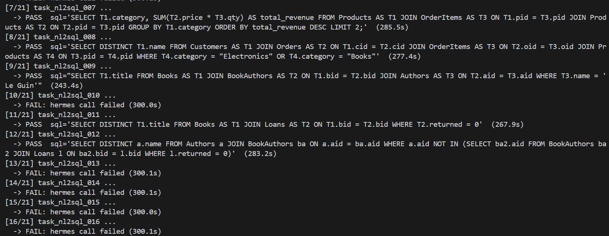
- 成因分析：這不是單一 SQL 語法錯誤，而是批次端對端測試中的系統性 timeout。早期版本確實有 agent workflow 過長的問題：原流程要求先 plan、再 validate、最多 retry 多次；若中間又遇到路徑搜尋或 validation contract 不一致，整體時間很容易累積到 300 秒上限。
- 後續補充：即使已精簡 `SKILL.md`，`run_dev.py` 連續批次執行仍可能系統性 timeout；但同一題若用單題 Hermes 指令直接呼叫，則能穩定通過。更精確地說，剩餘 timeout 主要來自 shared LiteLLM Gateway 在連續請求下的 latency degradation，屬外部基礎設施限制，不是 Text2SQL skill 的邏輯錯誤。

#### Timeout 成因拆解：可控與不可控因素

這次 timeout 最重要的觀察是：deterministic helper script 本身通常不慢，真正耗時的是「Hermes agent loop + LLM 服務端」這條端對端路徑。也就是說，timeout 不能只看成某個 Python script 寫錯，而要拆成三層：

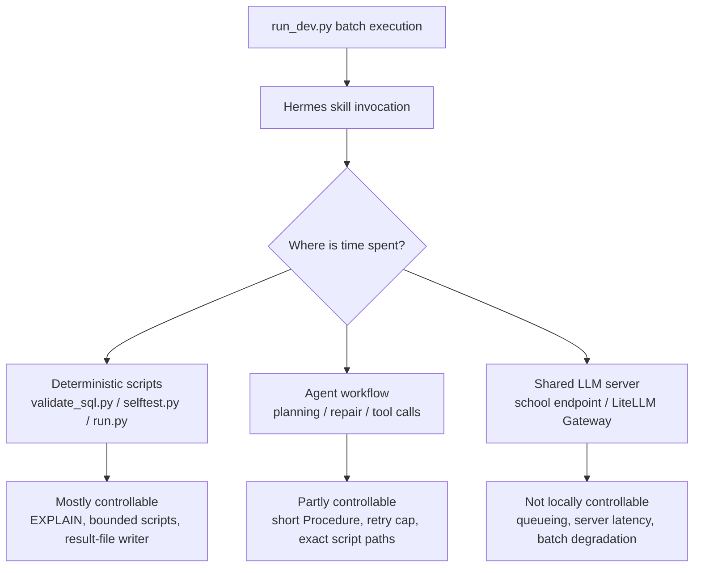

因此本專案對 timeout 的處理不是單純把 timeout 秒數調大，而是先把可控部分壓短：減少 agent 思考與工具往返、避免路徑搜尋、限制 retry 次數、讓 deterministic script 做固定且有限的工作。剩下的 shared server latency 則在報告中明確標成外部基礎設施因素，並用「單題 invocation 可通過、批次連續呼叫才 timeout」作為佐證。

- 修正方式：保留 `SKILL.md` 的 `Procedure` 標題，但將內容改成精簡流程，移除顯式 Plan 步驟，要求「draft -> validate -> write result file」；同時寫死 repo-relative script path，並將 retry 上限降為 2 次。
- 單題驗證方式：對批次 timeout 的題目，改用下列單題 invocation 驗證。所有批次 timeout 的題目在單題模式下皆可通過。

```powershell
hermes chat --toolsets skills,terminal --yolo -Q -q '/text2sql-YunzhenYang-collection {"task_id":"...","question":"...","db_schema":"..."}'
```

- 評分環境說明：老師已確認正式評分環境的 timeout 判定較本地 `run_dev.py` 寬鬆；只要 agent 持續有動作，評分流程會繼續等待，而不是因本地批次測試的固定 wall-clock timeout 立即判定失敗。
- MAST 分類：(3) 驗證與品質，並帶有外部基礎設施因素。Evaluation harness 的 timeout budget、agent workflow 長度，以及 shared LiteLLM Gateway 的連續請求延遲沒有完全對齊。

### 失敗 4 — Code Author 可成功輸出，但端對端時間超過 120 秒

- 觸發場景：執行 `python run_dev.py --track pairwise --role code-author` 時，所有題目皆在 120 秒後 timeout。
- log 片段：

```text
[progress] code-author 1/5: task_pair_001
[progress]   calling Hermes skill /code-author-YunzhenYang-collection ...
[progress]   FAIL hermes error after 120.1s: hermes timed out after 120s
[progress] code-author 2/5: task_pair_002
[progress]   FAIL hermes error after 120.1s: hermes timed out after 120s
```

- 截圖說明：
  - 呼叫 code-author 時發生 120 秒 timeout：
  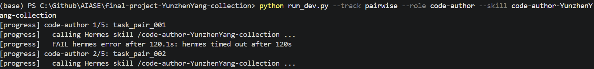`run_dev.py`
  - 直接用 Hermes venv 的 Python 執行 `selftest.py` 成功：
  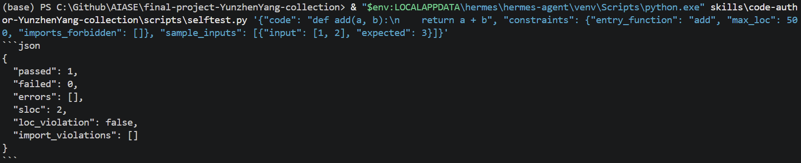
  - 透過 `ensurepip` 啟用 pip，並將 `radon==6.0.1` 安裝進 Hermes venv：
  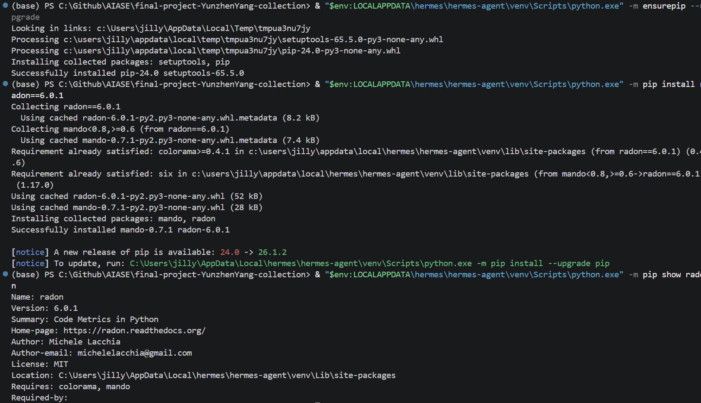
  - 直接呼叫單題時，Hermes 能成功載入 skill 並進入 `selftest.py`：
  
  - 單題 direct invocation 成功輸出 Code Author contract，但 session duration 仍為 `8m 36s`，超過正式 120 秒上限：
  
- 對照測試：直接在本機 shell 執行 `selftest.py` 可正常完成，表示 harness 本身可用，問題較可能發生在 Hermes 實際呼叫 skill 時的環境或流程。

```text
python skills\code-author-YunzhenYang-collection\scripts\selftest.py '{"code": "def add(a, b):\n    return a + b", "constraints": {"entry_function": "add", "max_loc": 500, "imports_forbidden": []}, "sample_inputs": [{"input": [1, 2], "expected": 3}]}'
```

```json
{
  "passed": 1,
  "failed": 0,
  "errors": [],
  "sloc": 2,
  "loc_violation": false,
  "import_violations": []
}
```

- 環境診斷：`where.exe hermes` 顯示 Hermes 來自自己的 venv，而 `where.exe python` 顯示目前 shell 也同時看到 anaconda 與 Hermes venv。進一步搜尋發現 Hermes venv 有 `python.exe`，但沒有找到 `pip.exe` 或 `radon.exe`。

```text
where.exe hermes
<HERMES_HOME>\venv\Scripts\hermes.exe
<HERMES_HOME>\hermes

where.exe python
<PYTHON_HOME>\python.exe
<HERMES_HOME>\venv\Scripts\python.exe
<USER_HOME>\AppData\Local\Programs\Python\Python311\python.exe
<USER_HOME>\AppData\Local\Programs\Python\Python312\python.exe
<USER_HOME>\AppData\Local\Microsoft\WindowsApps\python.exe
```

- 進一步診斷：直接用 Hermes venv 的 Python 執行 `selftest.py` 可以成功，表示 timeout 不是由 `selftest.py` 本身無法執行造成；但同一個 venv 執行 `python -m pip --version` 回傳 `No module named pip`，且找不到 `radon.exe`，確認 Hermes 執行環境與本機 anaconda 環境的 dependency 不一致。

```text
& "$env:LOCALAPPDATA\hermes\hermes-agent\venv\Scripts\python.exe" skills\code-author-YunzhenYang-collection\scripts\selftest.py '{"code": "def add(a, b):\n    return a + b", "constraints": {"entry_function": "add", "max_loc": 500, "imports_forbidden": []}, "sample_inputs": [{"input": [1, 2], "expected": 3}]}'
```

```json
{
  "passed": 1,
  "failed": 0,
  "errors": [],
  "sloc": 2,
  "loc_violation": false,
  "import_violations": []
}
```

```text
& "$env:LOCALAPPDATA\hermes\hermes-agent\venv\Scripts\python.exe" -m pip --version
<HERMES_HOME>\venv\Scripts\python.exe: No module named pip
```

- 成因分析：初步懷疑 `selftest.py` 的 `compute_sloc()` 依賴 `radon`，而 Hermes venv 未安裝 `radon==6.0.1`，導致 code-author 流程在 Hermes 端超時。後續直接測試顯示 Hermes venv 可以成功執行 `selftest.py`，且 direct Hermes invocation 也能在約 1-2 秒內完成 `selftest.py` tool call，因此更精確的判斷是：timeout 主要發生在 Hermes / LLM 端到端 workflow，而不是 candidate code 無限迴圈或 deterministic script 本身卡住。`radon` 缺失不是已證實的唯一原因，但仍是需要修補的環境不一致。
- 修正方式：將 radon 安裝進 Hermes venv：

```powershell
<HERMES_HOME>\venv\Scripts\pip.exe install radon==6.0.1
```

- 實際修復與驗證：由於 Hermes venv 原本沒有 `pip` module，先使用 `ensurepip` 啟用 pip，再透過 Hermes venv 的 Python 安裝 `radon==6.0.1`。安裝後 `pip show radon` 確認套件位於 Hermes venv 的 `Lib\site-packages`。

```powershell
& "$env:LOCALAPPDATA\hermes\hermes-agent\venv\Scripts\python.exe" -m ensurepip --upgrade
& "$env:LOCALAPPDATA\hermes\hermes-agent\venv\Scripts\python.exe" -m pip install radon==6.0.1
& "$env:LOCALAPPDATA\hermes\hermes-agent\venv\Scripts\python.exe" -m pip show radon
```

```text
Successfully installed pip-24.0 setuptools-65.5.0
Successfully installed mando-0.7.1 radon-6.0.1
Name: radon
Version: 6.0.1
Location: <HERMES_HOME>\venv\Lib\site-packages
```

- MAST 分類：(3) 驗證與品質。Deterministic harness 的 dependency 未與 Hermes 執行環境對齊，導致 evaluation pipeline 系統性失敗。

- 後續優化：將 `skills/code-author-YunzhenYang-collection/SKILL.md` 改成保留教授要求格式，但縮短流程：3 個 sample tests、exactly one `selftest.py` call、不使用 repair loop，最後只呼叫一次 `scripts/run.py` 寫 file-based result。此版本後續已透過 Hermes direct invocation 驗證能正確寫出結果檔。

---

### 失敗 5 — file-based 結果檔路徑問題（助教更新後）

- 觸發場景：助教將評分機制更新為 file-based output 後，skill 不再靠對話中的 fenced JSON 交付結果，而是必須將最終 contract 寫到 `AIASE_RESULT_PATH` 指定的檔案。早期測試時，Hermes 執行完成但 `run_dev.py` 仍回報 `no result file (task not produced)`。
- log 片段：

```text
Get-Content: Cannot find path '...\aiase_result.json' because it does not exist.
```

- 成因分析：新版 `run_dev.py` 會在呼叫 Hermes 前設定 `env["AIASE_RESULT_PATH"] = result_path`，評分器只讀這個檔案；但若 `SKILL.md` 的範例指令又在 shell 片段中自行設定 fallback，或模型只照 fallback 寫到 `./aiase_result.json`，結果就可能落在 Hermes 的 working directory，而不是評分器期待的 temp result path。Windows 本地測試時更容易因 PowerShell / subprocess / Hermes 子程序的環境傳遞差異而誤判；Linux 評分環境雖較穩定，但 skill 仍應避免依賴 cwd。
- 修正方式：四個正式 skill 的 `scripts/run.py` 都直接使用 `os.environ.get("AIASE_RESULT_PATH") or os.path.join(os.getcwd(), "aiase_result.json")` 決定輸出位置；`SKILL.md` 中則指示模型呼叫 `python skills/<skill-name>/scripts/run.py ...`，不在命令前重複設定環境變數，讓 `run_dev.py` 或評分器注入的 `AIASE_RESULT_PATH` 成為唯一權威。
- MAST 分類：(3) 驗證與品質。本地測試環境與正式評分流程對 output channel 的假設不一致，造成「skill 有執行，但評分器讀不到結果」的假失敗。

### 失敗 6 — Open Track 初版 SQL diff 穩定性不足

- 觸發場景：Open Track 初版只用同一個 SQLite connection 依序執行 `sql_a`、`sql_b`，且把任何 SQLite exception 都包成粗粒度的 `sqlite_error:`。這會造成三個問題：
  - 若 `sql_a` 失敗，程式直接 return，`sql_b` 即使可正常執行也不會留下 `columns_b` / `row_count_b`。
  - 若 `sql_a` 是 `DELETE`、`DROP` 或其他 side-effect SQL，可能改變 `sql_b` 的資料庫狀態。
  - 若 diff rows 很多，`rows_only_in_a` / `rows_only_in_b` 可能輸出數千筆，讓 result file 過大。

- 舊版風險範例：

```json
{
  "sql_a": "SELECT nonexistent_col FROM orders",
  "sql_b": "SELECT id FROM orders"
}
```

舊版輸出會只有：

```json
{
  "columns_a": [],
  "columns_b": [],
  "row_count_a": 0,
  "row_count_b": 0,
  "error": "sqlite_error: no such column: nonexistent_col"
}
```

這對 evaluator 與人工 debug 都不夠精準，因為 `sql_b` 的真實結果其實是可取得的。

- 修正方式：新版 `scripts/run.py` 改成以下 pipeline：

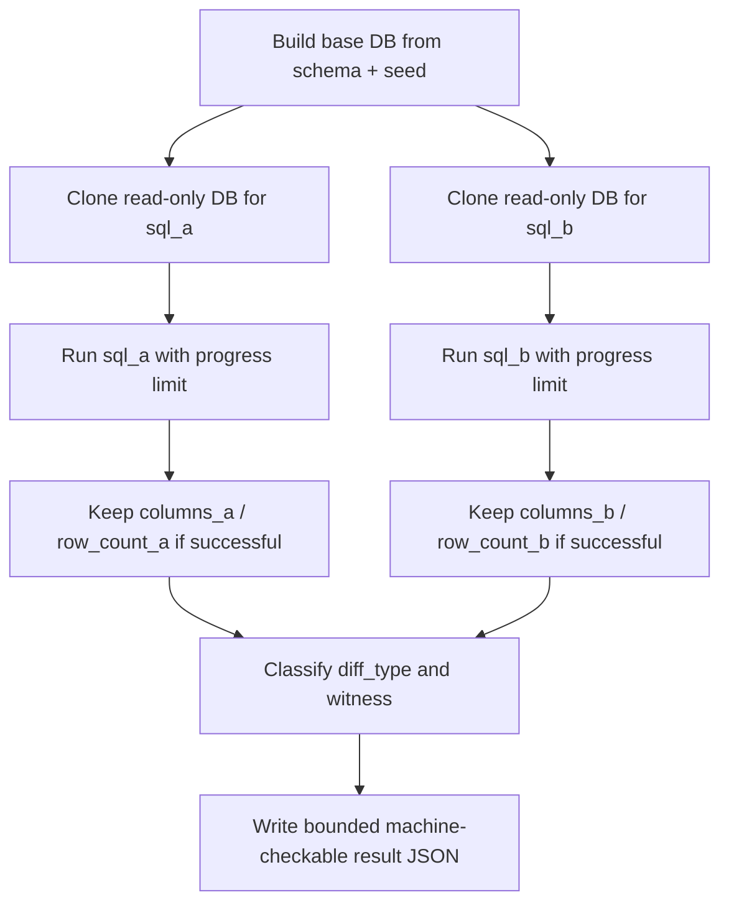

- 新版改善：
  - Error prefix 細分為 `schema_error:`、`seed_error:`、`sql_a_error:`、`sql_b_error:`、`sql_a_timeout:`、`sql_b_timeout:`。
  - `sql_a` / `sql_b` 使用 isolated read-only DB copies，side-effect SQL 不能污染另一邊。
  - 成功那一邊的 columns 與 row count 會保留，即使另一邊 SQL 失敗。
  - `diff_type` 讓 evaluator 可直接判斷失敗類型。
  - `witness` 提供最小反例，例如第一筆只出現在 `sql_a` 的 row，或 column mismatch 的兩邊欄位。
  - `rows_only_in_a_total` / `rows_only_in_b_total` 保留完整差異數，`rows_only_in_a` / `rows_only_in_b` 則各最多顯示 100 筆，避免輸出爆量。
  - SQLite progress handler 避免 recursive CTE 或巨大 join 卡住評分流程。

- 新版測試覆蓋：`tests/test_open_track.py` 目前包含 11 個案例，覆蓋 SQL A/B error preservation、missing input、numeric normalization、duplicate multiset、large diff truncation、side-effect isolation、BLOB、duplicate columns、timeout、column mismatch witness。

- MAST 分類：(3) 驗證與品質，以及安全與資源控制。Open Track verifier 本身是評分輔助工具，若它的錯誤粒度與隔離性不足，就會讓下游語意驗證不可信。

---

## 3. 改進方向

### a. 有做修正的項目

#### 1. SQL validation error 正規化

**問題來源：** 原本 `validate_sql.py` 的錯誤訊息直接來自 SQLite，例如 `no such column`。這雖然對人類可讀，但不利於 LLM 做 targeted repair，也不方便在報告或測試中統計常見失敗類型。

**修正內容：** 後續已將 validator 擴充為同時輸出原始錯誤細節與 machine-readable `error_code`。目前新增的分類包含 `unknown_column`、`unknown_table`、`syntax_error`、`empty_sql`、`multiple_statements`、`forbidden_statement`、`schema_error`、`sqlite_error`、`usage_error`、`invalid_json`。

實作上保留原本 `validate(schema_ddl, sql) -> (ok, error)` 介面，避免既有測試與呼叫端破壞；另外新增 `validate_detail(schema_ddl, sql) -> (ok, error, error_code)` 給 CLI 與新測試使用。CLI 輸出也從：

```json
{"ok": false, "error": "SQL did not compile: no such column: nonexistent"}
```

擴充為：

```json
{"ok": false, "error": "unknown_column: SQL did not compile: no such column: nonexistent", "error_code": "unknown_column"}
```

新增的 validator 測試已通過：

```powershell
python -m pytest tests/test_validate_sql.py -p no:cacheprovider
```

結果：`14 passed`：

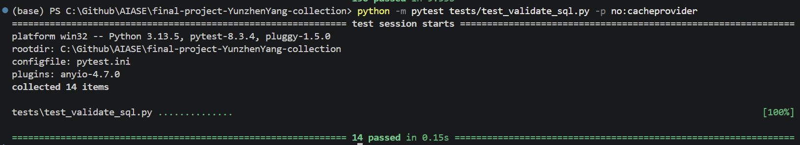
`log/error_normalization_test.png`

加入後的完整測試集執行也通過：

```powershell
python -m pytest -p no:cacheprovider
```

結果：`193 passed`：

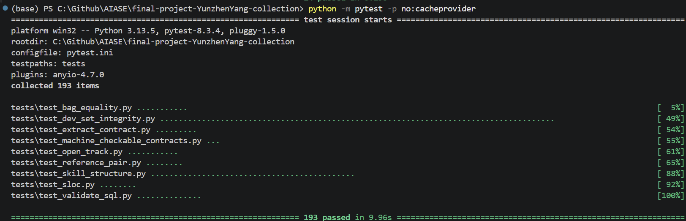
`log/error_normalization.png`


#### 2. Timeout workflow 壓縮

**問題來源：** 這次 timeout 的根本困難在於「agent 不要繼續想太久」並不完全是 skill code 可以控制的問題。實測中 deterministic helper script 通常在很短時間內完成，真正不可控的部分多半來自 LLM / Hermes 端到端 workflow，尤其目前使用學校提供的 shared LiteLLM Gateway / server endpoint；當連續批次請求造成 latency degradation 時，即使單題 direct invocation 可以通過，批次 `run_dev.py` 仍可能碰到 wall-clock timeout。

**修正內容：** 我把可控部分盡量壓短，而不是宣稱能完全消除模型端延遲。目前已做的速度限制包括：

- Text2SQL 移除顯式長篇 planning，改成 `draft -> validate -> write result file`。
- `validate_sql.py` 使用 `EXPLAIN` 做語法與 name resolution，不真正執行昂貴查詢。
- validation retry 上限設為 2 次，避免無限制 repair loop。
- `SKILL.md` 寫 repo-relative script path，避免 Hermes 先失敗再 `ls -R` 搜尋檔案。
- Code Author 改成 3 個 sample cases、exactly one `selftest.py`、一次 `run.py` 寫檔。
- Open Track 使用 SQLite progress handler 與 bounded diff output，避免 verifier 自己卡住。

改版前後的流程差異如下：

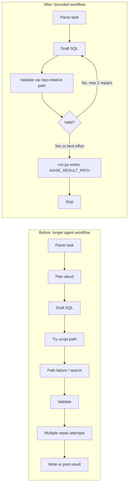

#### 3. 路徑與 JSON contract 的 machine-checkable tests

**問題來源：** 這次遇到的 Basic 問題有一部分與 contract 不一致有關：script path 與 schema key。這類錯誤單看很小，但在 Hermes agent loop 裡會造成額外搜尋、重試，甚至讓評分器讀不到結果檔。

**修正內容：** 新增 `tests/test_machine_checkable_contracts.py`，把這些容易因人工疏忽而壞掉的約束改成 pytest regression tests：

- 檢查四個正式 skill 的 `SKILL.md` 不再使用 `python scripts/...` 這種 skill-relative path，且文件中出現的 `python skills/.../scripts/*.py` repo-relative command path 都真實存在。
- 檢查 Text2SQL 的 `validate_sql.py` 同時支援 `schema_ddl` 與 `db_schema`，避免 grader payload key 與 helper script key 不一致。
- 檢查四個正式 skill 的 `scripts/run.py` 都會寫入 `AIASE_RESULT_PATH` 指定的 file-based result，且輸出 JSON 保留原始 `task_id`。另外也檢查 Bug Hunter 的 `verdict=clean -> bugs=[]` 規則，以及 Open Track equivalent case 的 `diff_type="equivalent"`。

新增測試已單獨通過：

```powershell
python -m pytest tests/test_machine_checkable_contracts.py -p no:cacheprovider
```

結果：`3 passed`：

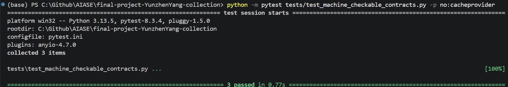
`log/machine_checkable_contracts.png`

加入後的完整測試集執行也通過：

```powershell
python -m pytest -p no:cacheprovider
```

結果：`190 passed`：

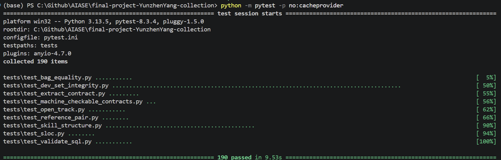
`log/no_cacheprovider.png`

### b. 保留目前程式碼的項目

#### 1. Basic harness 的 fixture-based execution test

**問題來源：** 目前 `validate_sql.py` 只用 `EXPLAIN` 檢查 SQL 語法、table / column / alias 是否存在，以及是否為 read-only query。這可以抓到 contract 與語法錯誤，但無法保證自然語言語意一定正確。

**保留原因：** 加入 fixture-based test 需要額外的 `db_seed` 與 expected rows，正式流程不一定能提供這些資料；若硬加入，反而可能讓 agent 多做不必要的 tool call，增加 timeout 風險。目前保留 `EXPLAIN` 作為輕量的 deterministic guard，語意對比交給 `run_dev.py` 與 Open Track verifier 處理。

#### 2. 將 Open Track 接回 Basic Track semantic checker

**問題來源：** Open Track 已經可以比較 `sql_a` 與 `sql_b` 在同一份 seed data 上的 multiset result，理論上可以接到 Basic Track 做 semantic diff。

**保留原因：** 正式流程不一定提供 reference SQL，如果在 Basic skill 裡假設它存在會讓 contract 偏離規格。目前讓 Basic skill 維持單純輸出 `{task_id, sql, rationale, confidence}`，Open Track 作為獨立 demo 證明 semantic checker 可行即可。

#### 3. Structured interaction logs

**問題來源：** 目前 log 只來自 Hermes terminal output，較難區分「deterministic script 慢」、「LLM 推理慢」、「shared endpoint 延遲」三種情況。理想上 `run_dev.py` 應輸出 JSONL，每筆記錄包含 skill name、task_id、exit code、duration、result file 是否存在、stdout / stderr digest。

**保留原因：** Structured logs 是診斷工具，不是核心功能；deadline 前更重要的是維持四個 skill 的穩定性，改動 logging pipeline 的優先級較低，留作後續改進方向。

---

## 4. 分工(單人組別，略過此區塊)

---

## 5. 引用說明

- 來源：`https://github.com/NousResearch/hermes-agent`（NousResearch Hermes Agent），
  使用範圍：整個專案的執行平台。`hermes chat --toolsets skills,terminal --yolo -Q -q` 的呼叫方式、
  skill 怎麼被載入、agent loop 怎麼運作，都是從這個 repo 的文件和原始碼理解的。
  差異：沒有動過 Hermes 的程式碼，SKILL.md 和 scripts/ 都是自己寫的。

- 來源：`https://agentskills.io/specification`（Agent Skills open standard），
  使用範圍：SKILL.md 的 frontmatter 格式，包括 name、description、version、
  metadata.hermes.tags 等欄位怎麼填，以及 When to Use / Procedure / Verification 的段落結構。
  差異：只是照著格式規範寫，觸發條件、執行流程、JSON 輸出 schema 都是自己根據課程需求設計的。

- 來源：AIASE 2026 期末專案規格書（`TAICA2026_FinalProject.md`，課程提供）與助教 file-based 更新說明，
  使用範圍：四個 track 的任務定義、輸出契約（file-based result、task_id 規則）、
  評分邏輯（bag equality、is_read_only_sql）、MAST 分類建議。
  差異：規格書是作業說明，SKILL.md、scripts/、失敗分析是自己做的。

- 來源：課程 starter repo 內的 reference skills（`reference-author-*`、`reference-bug-hunter-*`），
  使用範圍：理解 Pairwise Track 兩個角色的輸入輸出 schema、以及 SKILL.md 大概要寫到什麼程度。
  差異：自己的 code-author 和 bug-hunter 重新設計了 prompt 約束、self-test 流程和 JSON 欄位策略，
  沒有直接複製 reference skill 的內容。

- 來源：`https://arxiv.org/abs/2503.13657`（Cemri et al., 2025, "Why Do Multi-Agent LLM Systems Fail?"），
  使用範圍：Section 2 用了 MAST taxonomy 的三類詞彙來分類失敗案例。
  差異：只借了分類框架；timeout、路徑錯誤、schema key mismatch 這些案例都是開發過程中自己踩到的。

- 來源：`https://arxiv.org/abs/1809.08887`（Yu et al., EMNLP 2018, Spider Dataset），
  使用範圍：理解 Text2SQL evaluation 中 order-insensitive result comparison 的概念。
  差異：沒有用 Spider 的 evaluation.py 或資料集，實際比對是用課程的 bag_equal() 和自己的 SQLite harness。

- 來源：ChatGPT（chatgpt.com，OpenAI）與 Claude（claude.ai，Anthropic），
  使用範圍：SKILL.md 草稿、debug 思路、report 文字架構、錯誤處理邏輯建議。
  差異：AI 產出都有自己看過並修改，最終版本加入了課程規定以及助教提醒的 JSON 契約、task_id 規則、相對路徑要求和本地測試紀錄。

---

## 附錄：繳交前自我檢查清單

| 檢查項目 | 狀態 | 證據或說明 |
|---|---|---|
| Basic Track skill 存在 | 完成 | `skills/text2sql-YunzhenYang-collection/SKILL.md` |
| Pairwise 兩個角色 skill 存在 | 完成 | `skills/code-author-YunzhenYang-collection/SKILL.md`、`skills/bug-hunter-YunzhenYang-collection/SKILL.md` |
| Open Track skill 存在 | 完成 | `skills/open-sql-result-diff-YunzhenYang-collection/SKILL.md` |
| Pairwise role 宣告 | 完成 | `PAIRWISE_ROLE.md` 宣告 Code Author 與 Bug Hunter skill path |
| Open Track 宣告 | 完成 | `OPEN_TRACK.md` 說明呼叫方式、input schema、metric、pass/fail 判定 |
| `SKILL.md` name 與資料夾名稱一致 | 完成 | 由 `tests/test_machine_checkable_contracts.py` 與人工檢查確認 |
| 使用 repo-relative script path | 完成 | 四個正式 skill 不依賴 `python scripts/...` 這種 skill-relative path |
| 支援 `AIASE_RESULT_PATH` file-based result | 完成 | 四個正式 skill 的 `scripts/run.py` 皆會寫入指定 result file |
| 輸出保留輸入 `task_id` | 完成 | `run.py` 與 machine-checkable tests 檢查 |
| 不依賴外部網路或個人 secret | 完成 | SQL / code / bug analysis 均使用 repo 內 scripts 與 Python 標準或已宣告 dependency |
| 不依賴本機絕對路徑 | 完成 | script 呼叫使用 repo-relative path；result file 使用環境變數 |
| Timeout 風險已壓低 | 完成 | workflow 縮短、retry bounded、Open Track progress handler、bounded diff output |
| 本地測試與截圖證據 | 完成 | report 中已附 `verify_repo.py`、pytest、Hermes demo 與失敗修復截圖 |
